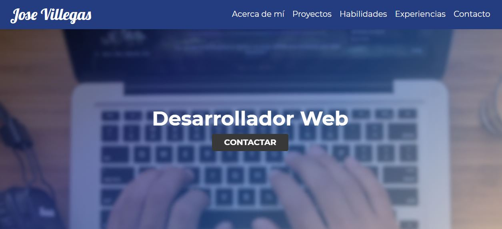

# Portafolio José Villegas 


## Descripción 📋
Código de mi portafolio personal. 




## Ejecutando las pruebas ⚙️
```
npm install
gulp
```

## Herramientas 🛠️

* [Visual Studio](https://visualstudio.microsoft.com/es/) - IDE
* [Node.js](node.js) - Entorno 
* [npm](https://www.npmjs.com/) -  Gestión de paquetes
* [Gulp](https://gulpjs.com/) -  Kit de herramientas JavaScript
* [Git](https://git-scm.com/) - Control de Versiones


###   Míralo aquí - [Portafolio José Villegas](https://likegallery.netlify.app/)
